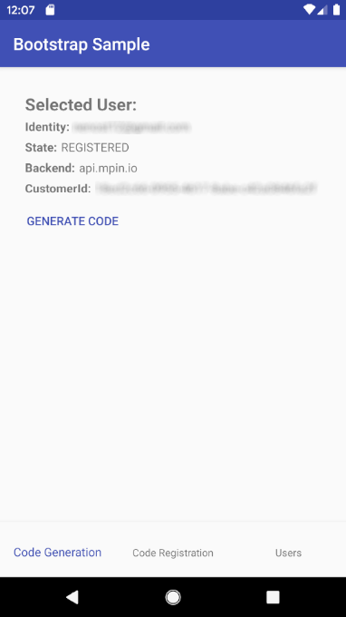
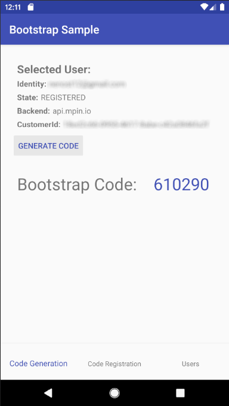
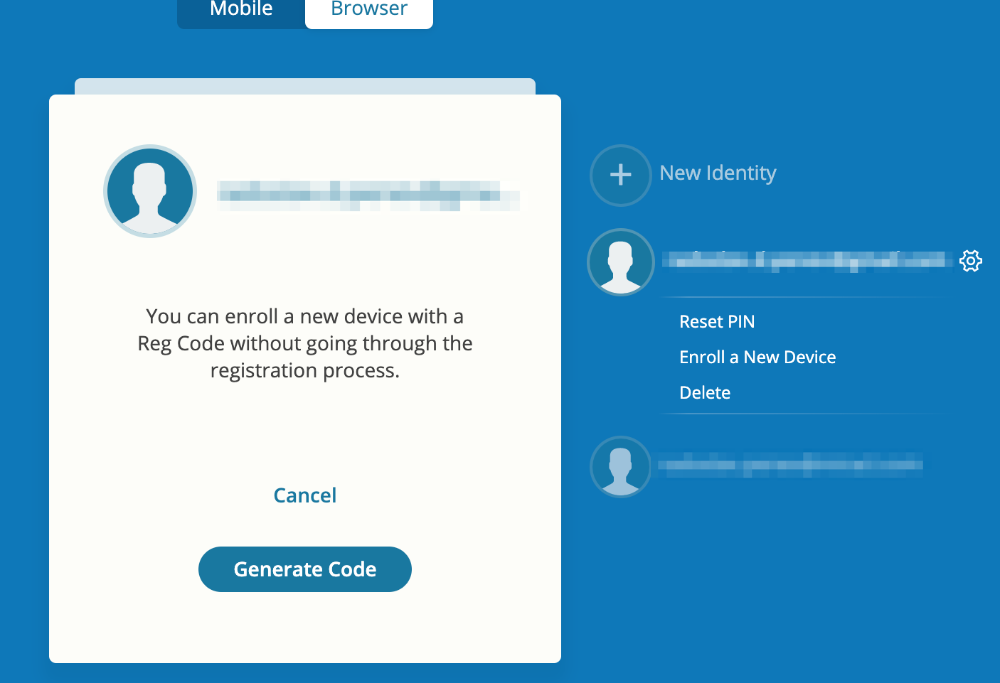
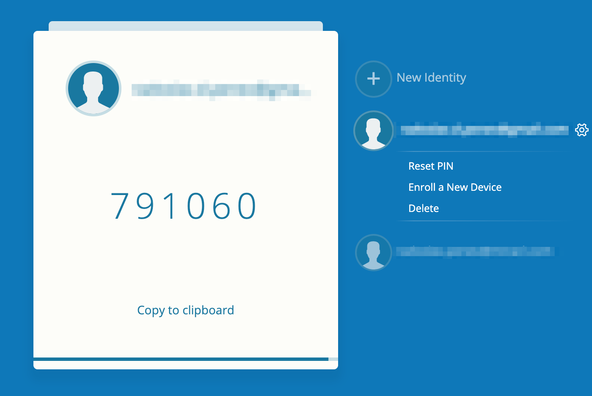
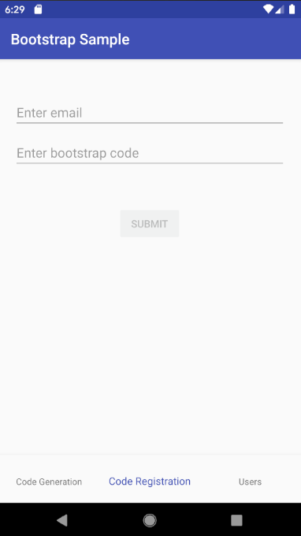
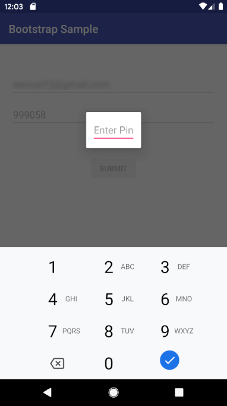
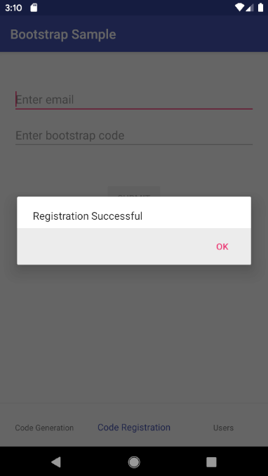

# Bootstrap Sample

* **category**: Samples
* **copyright**: 2019 MIRACL Technologies LTD
* **link**: https://github.com/miracl/sample-mobile-app-android/tree/master/BootstrapSample

## Description

This sample demonstrates how to use the [MIRACL Android SDK](https://github.com/miracl/mfa-client-sdk-android) in order to transfer an identity from and to another device without the need of another customer verification. This is done by the so-called bootstrap codes and there are two cases depending on what the user wants to achieve.

The flow called `Bootstrap Code Generation` represents the case when there is already a registered identity on the device and the user wants to transfer it on another device:


The flow called `Bootstrap Code Registration` represents the case when the user creates a new identity on the device using an already generated bootstrap code from another device:


Keep in mind, that the bootstrap codes are currently available only for enterprise users. If you wish to make use of them, please contact us at support@miracl.com.

## Requirements

* Android Studio with Android SDK 16 or higher
* Android SDK build tools 29.0.1

## Setup
1. Checkout the sample project from: https://github.com/miracl/sample-mobile-app-android.git
>> git clone https://github.com/miracl/sample-mobile-app-android.git
2. [Run a backend application](#create-a-demo-web-app-to-act-as-a-backend-service)
3. [Configure the app with the issued credentials](#configure-the-app-with-the-issued-credentials)
4. Build the project from:
    * **Android Studio**
        1. Import the project - File -> Open -> \<sample-mobile-app-android\>
        2. Select the 'BootstrapSample' from the configuration menu
        3. Click on the 'Build' menu, then choose 'Build Bundle(s) / APK(s)' and select 'Build APK(s)'
        4. The assembled apk will be located in `./BootstrapSample/build/outputs/apk`
    * **Command Line:**
        1. Navigate to the top level folder of the Android project
        2. Execute `$ ./gradlew build`
        3. The assembled apk will be located in `./BootstrapSample/build/outputs/apk`

## Create a demo web app to act as a backend service

In order to be able to test the demo Android app, you need to run a backend service as a relying party demo web app (RPA). The demo app should authenticate to the [MIRACL Trust authentication portal](https://trust.miracl.cloud/), called also MFA, using [OpenIDConnect](https://openid.net/connect/) protocol. More information could be found [here](http://docs.miracl.cloud/oidc-client-setup/). This means you need to login and create an application in the portal and use its credentials (`client id` and `client secret`) in the demo web app for the communication.

For the case of that sample, there is one more endpoint the RPA should implements as it is done at [this sample RPA project](https://github.com/miracl/maas-sdk-dotnet-core2#sample-endpoints):
* POST `/authzurl`
 This should return the following json formatted data on success as it is done [here](https://github.com/miracl/maas-sdk-dotnet-core2/blob/master/MiraclAuthenticationApp.Core2.0/Controllers/authtokenController.cs#L13):
```
{
    "authorizeURL": "<- The authorization url to the MFA ->"
}
```

Once you have run the demo web app you need to host it on a visible uri for the mobile app. Just be sure that the proper redirect uri (constructed as `demoAppUri/login`) is added as a redirect uri to the [authentication portal](https://trust.miracl.cloud/) application settings you're running this web app with:


## Configure the app with the issued credentials

Before building an Android app, you need to configure it through the [./BootstrapSample/src/main/res/values/strings.xml](src/main/res/values/strings.xml) file:

```
<!-- M-Pin configuration -->
<string name="mpin_cid" formatted="false" translatable="false">mpin_cid goes here</string>
<string name="mpin_backend" formatted="false" translatable="false">https://api.mpin.io</string>

<!-- Custom service configuration -->
<string name="access_code_service_base_url" formatted="false" translatable="false">http://<demowebapp_url>/</string>
```

As the owner of the MFA web app, your `Company ID` is visible as a tooltip in the top right corner of your company dashboard in the MFA portal:


Note that `mpin_backend` should always be https://api.mpin.io in order to authenticate against [MIRACL Trust authentication portal](https://trust.miracl.cloud/).

`<demowebapp_url>` is the url of your demo backend application [configured here](#create-a-demo-web-app-to-act-as-a-backend-service).

## Bootstrap flows implementation by MIRACL Android SDK

Application flows, described at the [beginning](#description) of the readme, are demonstrated in two tabs using `BottomNavigationView` wherein `Code Generation` tab `Bootstrap code generation` flow is implemented and `Code Registration` implements `Bootstrap Code registration` flow. Also there is a tab that lists user identities and gives an opportunity to delete an identity.

### SDK Initialization

The SDK is [intialized](https://github.com/miracl/mfa-client-sdk-android#status-initmapstring-string-config-context-context) in [SampleApplication.java](src/main/java/com/miracl/mpinsdk/bootstrapsample/SampleApplication.java) and the same instance is used throughout the flow using `getMfaSdk()` method.

```
sMPinMfa = new MPinMfaAsync(this);
sMPinMfa.init(this, null);
```
```
public static MPinMfaAsync getMfaSdk() {
    return sMPinMfa;
}
```

### Bootstrap Code Generation

All of the work is done at [`CodeGenerationFragment.java`](src/main/java/com/miracl/mpinsdk/bootstrapsample/CodeGenerationFragment.java), which is presented when `Code Generation` tab is clicked.

When you run the demo there are two buttons on the screen:
* `Select User` - opens a list of already registered identities from which user can select;
* `Register New User` - uses the registration flow described [here](https://github.com/miracl/sample-mobile-app-android/blob/master/MobileAppLoginSample/README.md#registeruseractivityjava) to create a new identity from scratch in order to have an identity to generate the bootstrap code with.

Choosing `Select User` and selecting an already registered identity from the list displays the following information:



If you want to move the selected user identity to another device, press `Generate Code` button. Then [getMfaSdk().startAuthenticationRegCode](https://github.com/miracl/mfa-client-sdk-android#status-startauthenticationregcodeuser-user) method is called which kicks-off the authentication process:

```
SampleApplication.getMfaSdk().startAuthenticationRegCode(mCurrentUser, new MPinMfaAsync.Callback<Void>() {
    ...
}
```

If status `OK` is returned, the user is asked for their PIN. Then [getMfaSdk().finishAuthenticationRegCode](https://github.com/miracl/mfa-client-sdk-android#status-finishauthenticationregcodeuser-user-string-multifactor-regcode-regcode) method is called to finalize the authentication process:

```
SampleApplication.getMfaSdk().finishAuthenticationRegCode(mCurrentUser, new String[]{pin}, new MPinMfaAsync.Callback<RegCode>() {
    ...
}
```

If the authentication for the bootstrap code is successful, an `RegCode` object is passed which is displayed to the user, so they can enroll it in another device:

```
((TextView) getView().findViewById(R.id.tv_bootstrap_code)).setText(regCode.otp);
```



### Bootstrap Code Registration

To register with a bootstrap code, the user needs to go to a device where they already have an identity created. You could use either another mobile app with an already registered identity, or the [backend](#create-a-demo-web-app-to-act-as-a-backend-service) configured for this demo sample. Here we describe the second choice with running our [dotnet SDK](https://devdocs.trust.miracl.cloud/sdk-instructions/dotnet-core/) sample as a backend.

Go to the login identity screen of your backend and click on the settings icon of an already registered identity. There is an option called `Enroll a New Device`:



Keep in mind that if you don't see `Enroll a New Device` option, you are not an enterprise user. If you need this functionality, contact us at support@miracl.com.

`Enroll a New Device` requires authentication and asks you for your PIN. Then it displays the bootstrap code you need to use in your mobile device to transfer the identity to your phone.



Back to this demo sample, аll of the work is done at [`CodeRegistrationFragment`](src/main/java/com/miracl/mpinsdk/bootstrapsample/CodeRegistrationFragment.java), which is presented when `Code Registration` tab is clicked.



The user registration is started by `onSubmitClick()` handler where [AccessCodeObtainingTask](#accesscodeobtainingtaskjava) is executed in order to create the access code which is used to start the registration.

Then, it needs to be verified if it doesn't already exist an user with the same ID with [`getMfaSdk().isUserExisting`](https://github.com/miracl/mfa-client-sdk-android#boolean-isuserexistingstring-id) method. Finally, a user can be created with [`getMfaSdk().makeNewUser`](https://github.com/miracl/mfa-client-sdk-android#user-makenewuserstring-id) method:

```
SampleApplication.getMfaSdk().isUserExisting(email, new MPinMfaAsync.Callback<Boolean>() {
    @Override
    protected void onSuccess(@Nullable Boolean isUserExisting) {
        if (isUserExisting) {
            mMessageDialog.show(getString(R.string.user_already_registered_message));
            enableControls();
            return;
        } else {
            SampleApplication.getMfaSdk().makeNewUser(email, "Android Sample App", new MPinMfaAsync.Callback<User>() {
                ...
            }
        }
    }
}
```

When the user is created, registration can be started with a call to [`getMfaSdk().startRegistration`](https://github.com/miracl/mfa-client-sdk-android#status-startregistrationuser-user-string-accesscode-string-pushtoken-string-regcode):

```
SampleApplication.getMfaSdk().startRegistration(SampleApplication.getCurrentAccessCode(), mCurrentUser, null, bootstrapCode, new MPinMfaAsync.Callback<Void>() {
    ...
}
```

If status `OK` is returned, the `mEnterPinDialog` is shown to the user to create a PIN code for their new identity on this device:



To finalize the registration [`getMfaSdk().confirmRegistration`](https://github.com/miracl/mfa-client-sdk-android#status-confirmregistrationuser-user) and [`getMfaSdk().finishRegistration`](https://github.com/miracl/mfa-client-sdk-android#status-finishregistrationuser-user-string-multifactor) methods are called:
```
SampleApplication.getMfaSdk().confirmRegistration(mCurrentUser, new MPinMfaAsync.Callback<Void>() {

    @Override
    protected void onSuccess(@Nullable Void result) {
        SampleApplication.getMfaSdk().finishRegistration(mCurrentUser, new String[]{pin}, new MPinMfaAsync.Callback<Void>() {
            ...
        }
    }
}
```

and a message is presented to show the user they have already a registered identity on that device:



### AccessCodeObtainingTask.java

This task makes use of [rest/AccessCodeServiceApi.java](src/main/java/com/miracl/mpinsdk/bootstrapsample/rest/AccessCodeServiceApi.java) to get the authorization url from your demo web app:

```
Response<AuthorizeUrlInfo> responseAuthUrl = accessCodeServiceApi.getAuthURL().execute();
```

and, subsequently, call [getMfaSdk().getAccessCode](https://github.com/miracl/mfa-client-sdk-android#status-getaccesscodestring-authzurl-stringbuilder-accesscode) using it:

```
com.miracl.mpinsdk.model.Status status = mfaSdk.getAccessCode(urlInfo.getAuthorizeUrl(), accessCodeContainer);
```

## See also

* [MobileAppLoginSample](https://github.com/miracl/sample-mobile-app-android/tree/master/MobileAppLoginSample)
* [WebsiteLoginSample](https://github.com/miracl/sample-mobile-app-android/tree/master/WebsiteLoginSample)
* [DvsSample](https://github.com/miracl/sample-mobile-app-android/tree/master/DvsSample)
