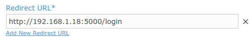
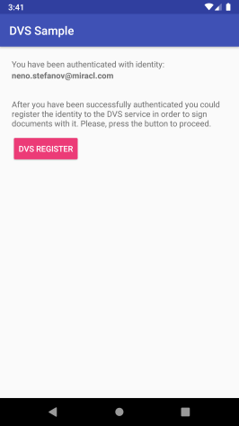
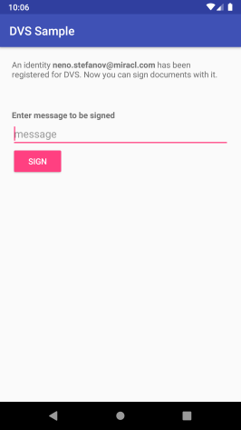
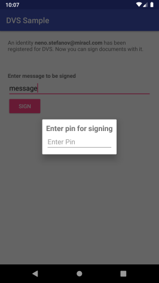
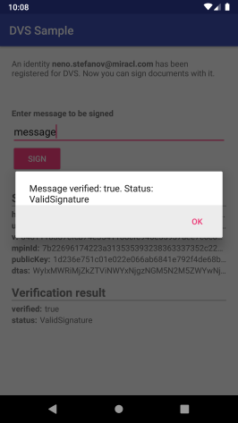

# DVS Sample

* **category**: Samples
* **copyright**: 2019 Miracl Technologies LTD
* **link**: https://github.com/miracl/sample-mobile-app-android/tree/master/DvsSample

## Description

This sample demonstrates how to use the [MIRACL Android SDK](https://github.com/miracl/mfa-client-sdk-android) in order to sign a transaction which can only be verified by a designated verifier using the [MIRACL MFA Platform](https://trust.miracl.cloud) authentication via an Android device. These are the so-called **DVS Registration** and **DVS Signing** flows and here is the methods sequence you need to follow in order to achieve it:


## Requirements

* Android Studio with Android SDK 16 or higher
* Android SDK build tools 25.0.0

## Setup
1. Checkout the sample project from: https://github.com/miracl/sample-mobile-app-android.git
>> git clone https://github.com/miracl/sample-mobile-app-android.git
2. [Run a backend application](#create-a-demo-web-app-to-act-as-a-backend-service)
3. [Configure the app with the issued credentials](#configure-the-app-with-the-issued-credentials)
4. Build the project from:
    * **Android Studio**
        1. Import the project - File -> Open -> \<sample-mobile-app-android\>
        2. Select the 'DvsSample' from the configuration menu
        3. Click on the 'Build' menu, then choose 'Build Bundle(s) / APK(s)' and select 'Build APK(s)'
        4. The assembled apk will be located in `./DvsSample/build/outputs/apk`
    * **Command Line:**
        1. Navigate to the top level folder of the Android project
        2. Execute `$ ./gradlew build`
        3. The assembled apk will be located in `./DvsSample/build/outputs/apk`

## Create a demo web app to act as a backend service

In order to be able to test the demo DVS sample app, you need to run a backend service as a relying party demo web app (RPA). The demo app should authenticate to the [MIRACL Trust authentication portal](https://trust.miracl.cloud/), called also MFA, using [OpenIDConnect](https://openid.net/connect/) protocol. More information could be found [here](http://docs.miracl.cloud/oidc-client-setup/). This means you need to login and create an application in the portal and use its credentials (`client id` and `client secret`) in the demo web app for the communication.

This sample uses the mobile app login in order to register and authenticate an identity so it can make DVS operations with it. This means that the web app should implements the following endpoints as it is done at [this sample RPA project](https://github.com/miracl/maas-sdk-dotnet-core2#sample-endpoints):
* POST `/authzurl`
 This should return the following json formatted data on success as it's done [here](https://github.com/miracl/maas-sdk-dotnet-core2/blob/master/MiraclDvsSigningApp.Core2.0/Controllers/authzurlController.cs#L6):
```
{
    "authorizeURL": "<- The authorization url to the MFA ->"
}
```
* POST `/authtoken`
 This endpoint should authenticate by a specified Authorization Code and User ID, passed in the following format:
```
{
    "code":"<- the authorization code to validate with ->",
    "userID":"<- the authorized email to be verified ->"
}
```
The http status code of the response could correspond to the status of the authentication. A sample could be found [here](https://github.com/miracl/maas-sdk-dotnet-core2/blob/master/MiraclDvsSigningApp.Core2.0/Controllers/authtokenController.cs#L13).

Two more endpoints are necessary for the DVS operations:
* POST `/document`
The user signs a hash of the document, not the document itself. The web demo needs to have an endpoint to create this hash. It should accept the document to be signed and return its hash and a time stamp of its creation. By default SHA256 algorithm is used to compute the hash.
You could review a sample handler for this [here](https://github.com/miracl/maas-sdk-dotnet-core2/blob/master/MiraclDvsSigningApp.Core2.0/Controllers/loginController.cs#L53).

* POST `/verify-signature`
An additional call to the web demo should verify if the document hash is properly signed. There should be an endpoint which accepts a json formatted signature data with the following structure:
```
{
    "hash" : "<- the hash of the signed document ->",
    "mpinId" : "<- the M-Pin ID used to generate the signature ->",
    "u" : "<- the random commitment generated by the user ->",
    "v" : "<- the proof of the signature ->",
    "publicKey" : "<- the user public key used in the key-escrow less scheme (if supported) ->",
    "dtas" : "<- the DTAs used for signing ->"
}
```
and returns true/false if the signature is valid or not. [Here](https://github.com/miracl/maas-sdk-dotnet-core2/blob/master/MiraclDvsSigningApp.Core2.0/Controllers/loginController.cs#L66) is a sample handler you could review for a reference.

Once you have run the demo web app you need to host it on a visible URI for the mobile app. Just reassure that the proper redirect URI (`demoAppUri/login`) is added as a redirect URI to the [authentication portal](https://trust.miracl.cloud/) application settings you're running the web app with:



## Configure the app with the issued credentials

Before building an Android app, you need to configure it through the [./DvsSample/src/main/res/values/strings.xml](src/main/res/values/strings.xml) file:

```
<!-- M-Pin configuration -->
<string name="mpin_cid" formatted="false" translatable="false">mpin_cid goes here</string>
<string name="mpin_backend" formatted="false" translatable="false">https://api.mpin.io</string>

<!-- Custom service configuration -->
<string name="access_code_service_base_url" formatted="false" translatable="false">http://<demowebapp_url>/</string>
```

As the owner of the MFA web app, your `Company ID` is visible as a tooltip in the top right corner of your company dashboard in the MFA portal:


Note that `mpin_backend` should always be https://api.mpin.io in order to authenticate against [MIRACL Trust authentication portal](https://trust.miracl.cloud/).

`<demowebapp_url>` is the url of your demo backend application [configured here](#create-a-demo-web-app-to-act-as-a-backend-service).

## **DVS Sample** implementation by MIRACL Android SDK

This sample also uses [**Registration**](https://github.com/miracl/sample-mobile-app-android/tree/master/MobileAppLoginSample#registeruseractivityjava) and [**Mobile App Login**](https://github.com/miracl/sample-mobile-app-android/tree/master/MobileAppLoginSample#loginactivityjava) flows, which are explained in detail [here](https://github.com/miracl/sample-mobile-app-android/tree/master/MobileAppLoginSample#mobile-app-login-flow-implementation-by-miracl-android-sdk), in order to login into the mobile app itself. In this documentation, we focus only on the DVS implementation flows, so we accept that the user is already issued with a `user ID` and an `access token`.

### SDK initialization

The SDK is [intialized](https://github.com/miracl/mfa-client-sdk-android#status-initmapstring-string-config-context-context) in [SampleApplication.java](src/main/java/com/miracl/mpinsdk/dvssample/SampleApplication.java) and the same instance is used throughout the flow using `getMfaSdk()` method.

```
sMPinMfa = new MPinMfaAsync(this);
sMPinMfa.init(this, null);
```
```
public static MPinMfaAsync getMfaSdk() {
    return sMPinMfa;
}
```

## DVS Registration

The user needs to have a DVS identity (different than their authentication identity with the same user id) in order to sign documents, which is implemented at [DvsRegistrationActivity.java](src/main/java/com/miracl/mpinsdk/dvssample/DvsRegistrationActivity.java). If a user has a DVS identity could be checked by the user [`canSign`](https://github.com/miracl/mfa-client-sdk-android#user-makenewuserstring-id-string-devicename) method. If it returns false, you need to create a signing identity for it. They need to authenticate first. That's why when `DVS REGISTER` button is clicked the user needs to enter their authentication identity PIN in order to start the registration for the DVS functionality with [getMfaSdk().startRegistrationDvs](https://github.com/miracl/mfa-client-sdk-android#status-startregistrationdvsuser-user-string-multifactor) method:



```
SampleApplication.getMfaSdk().startRegistrationDvs(SampleApplication.getLoggedUser(), new String[]{pin}, new MPinMfaAsync.Callback<Void>() {
  ...
}
```

If status OK is returned, the user is asked for their DVS Signing PIN. Then [getMfaSdk().finishRegistrationDvs](https://github.com/miracl/mfa-client-sdk-android#status-finishregistrationdvsuser-user-string-multifactor) method is called to complete their DVS Identity registration. Then the user could sign documents using the [DVS Signing](#dvs-signing) flow.

```
SampleApplication.getMfaSdk().finishRegistrationDvs(SampleApplication.getLoggedUser(), new String[]{pin}, new MPinMfaAsync.Callback<Void>() {
  ...
}
```

## DVS Signing

For simplicity signing in [SignMessageActivity.java](src/main/java/com/miracl/mpinsdk/dvssample/SignMessageActivity.java) is done for a simple string, but could be done for different resources like files or pictures, that could be represented as a string. Keep in mind, that better usage of DVS is to sign the document hash, not the whole file instead.



The user needs to enter some text and click `SIGN` button. The DVS Identity PIN is required to sign the text.
[CreateDocumentHashTask](src/main/java/com/miracl/mpinsdk/dvssample/CreateDocumentHashTask.java) is executed to create a transaction of type [DocumentDVSInfo](src/main/java/com/miracl/mpinsdk/dvssample/rest/model/DocumentDvsInfo.java) from the document text by making a `POST` request to the RPA backend service.

```
new CreateDocumentHashTask(getString(R.string.access_code_service_base_url), document, new CreateDocumentHashTask.Callback() {
  ...
}).execute();
```

Once the RPA backend service has returned the [DocumentDVSInfo](src/main/java/com/miracl/mpinsdk/dvssample/rest/model/DocumentDvsInfo.java) to the mobile client app, [getMfaSdk().verifyDocumentHash](https://github.com/miracl/mfa-client-sdk-android#boolean-verifydocumenthashbyte-document-byte-documenthash) method verifies that the transaction hash value is correct for the given document:

```
SampleApplication.getMfaSdk().verifyDocumentHash(document.getBytes(), documentDvsInfo.getHash().getBytes(), new MPinMfaAsync.Callback<Boolean>() {
  ...
}
```

When the returned hash value is verified, the user is asked for their signing identity PIN:




Then, to sign the transaction, [getMfaSdk().sign](https://github.com/miracl/mfa-client-sdk-android#status-signuser-user-byte-documenthash-string-multifactor-int-epochtime-string-authztoken-signature-signature) method is used:

```
SampleApplication.getMfaSdk().sign(SampleApplication.getLoggedUser(), documentDvsInfo.getHash().getBytes(), new String[]{pin}, documentDvsInfo.getTimestamp().intValue(), new MPinMfaAsync.Callback<Signature>() {
  ...
}

```

If the signing is successful, the returned signature is verified by [VerifySignatureTask](src/main/java/com/miracl/mpinsdk/dvssample/VerifySignatureTask.java). The result is displayed to the screen:



## See also

* [MobileAppLoginSample](https://github.com/miracl/sample-mobile-app-android/tree/master/MobileAppLoginSample)
* [WebsiteLoginSample](https://github.com/miracl/sample-mobile-app-android/tree/master/WebsiteLoginSample)
* [BootstrapSample](https://github.com/miracl/sample-mobile-app-android/tree/master/BootstrapSample)
