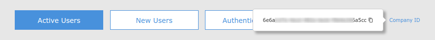
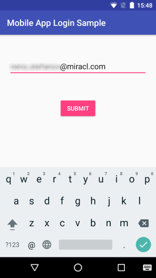
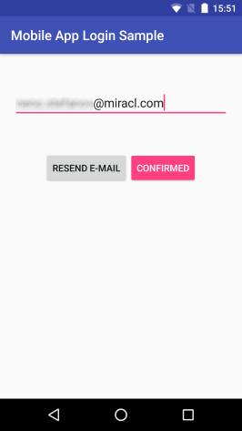
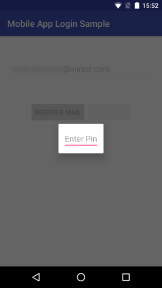
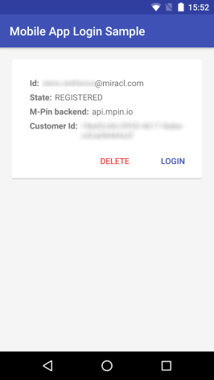
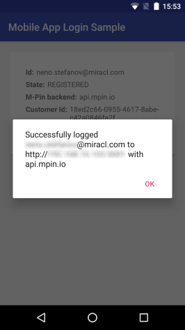

# Mobile App Login Sample

* **category**: Samples
* **copyright**: 2019 MIRACL Technologies LTD
* **link**: https://github.com/miracl/sample-mobile-app-android/tree/master/MobileAppLoginSample

## Description

This sample demonstrates how to use the [MIRACL Android SDK](https://github.com/miracl/mfa-client-sdk-android) in order to login into the mobile app itself using [MIRACL MFA Platform](https://trust.miracl.cloud) authentication via an Android device. This is the so called **Mobile App Login** flow and here is the methods sequence you need to achieve it:


## Requirements

* Android Studio with Android SDK 16 or higher
* Android SDK build tools 25.0.0

## Setup
1. Checkout the sample project from: https://github.com/miracl/sample-mobile-app-android.git
>> git clone https://github.com/miracl/sample-mobile-app-android.git
2. [Run a backend application](#create-a-demo-web-app-to-act-as-a-backend-service)
3. [Configure the app with the issued credentials](#configure-the-app-with-the-issued-credentials)
4. Build the project from:
    * **Android Studio**
        1. Import the project - File -> Open -> \<sample-mobile-app-android\>
        2. Select the 'MobileAppLoginSample' from the configuration menu
        3. Click on the 'Build' menu, then choose 'Build Bundle(s) / APK(s)' and select 'Build APK(s)'
        4. The assembled apk will be located in `./MobileAppLoginSample/build/outputs/apk`
    * **Command Line:**
        1. Navigate to the top level folder of the Android project
        2. Execute `$ ./gradlew build`
        3. The assembled apk will be located in `./MobileAppLoginSample/build/outputs/apk`

## Create a demo web app to act as a backend service

In order to be able to test the demo Android app you need to run a backend service as a relying party demo web app (RPA). The demo app should authenticate to the [MIRACL Trust authentication portal](https://trust.miracl.cloud/), called also MFA, using [OpenIDConnect](https://openid.net/connect/) protocol. More information could be found [here](http://docs.miracl.cloud/oidc-client-setup/). This means you need to login and create an application in the portal and use its credentials (`client id` and `client secret`) in the demo web app for the communication.

For the case of that sample, there are two more endpoints the RPA should implement as it is done at [this sample RPA project](https://github.com/miracl/maas-sdk-dotnet-core2#sample-endpoints):
* POST `/authzurl`
 This should return the following json formatted data on success as it is done [here](https://github.com/miracl/maas-sdk-dotnet-core2/blob/master/MiraclAuthenticationApp.Core2.0/Controllers/authtokenController.cs#L13):
```
{
    "authorizeURL": "<- The authorization url to the MFA ->"
}
```
* POST `/authtoken`
 This endpoint should authenticate by a specified Authorization Code and User ID, passed in the following format:
```
{
    "code":"<- the authorization code to validate with ->",
    "userID":"<- the authorized email to be verified ->"
}
```
The http status code of the response could correspond to the status of the authentication. A sample could be seen [here](https://github.com/miracl/maas-sdk-dotnet-core2/blob/master/MiraclAuthenticationApp.Core2.0/Controllers/authzurlController.cs#L9).

Once you have run the demo app you need to host it on a visible uri for the mobile app. Just be sure that the proper redirect uri (constructed as `demoAppUri/login`) is added as a redirect uri to the [authentication portal](https://trust.miracl.cloud/) application settings you're running this web app with:


## Configure the app with the issued credentials

Before building an Android app, you need to configure it through the [./MobileAppLoginSample/src/main/res/values/strings.xml](src/main/res/values/strings.xml) file:

```
<!-- M-Pin configuration -->
<string name="mpin_cid" formatted="false" translatable="false">mpin_cid goes here</string>
<string name="mpin_backend" formatted="false" translatable="false">https://api.mpin.io</string>

<!-- Custom service configuration -->
<string name="access_code_service_base_url" formatted="false" translatable="false">http://<demowebapp_url>/</string>
```

As the owner of the MFA web app, your `Company ID` is visible as a tooltip in the top right corner of your company dashboard in the MFA portal:



Note that `mpin_backend` should always be https://api.mpin.io in order to authenticate against [MIRACL Trust authentication portal](https://trust.miracl.cloud/).

`<demowebapp_url>` is the url of your demo backend application [configured here](#create-a-demo-web-app-to-act-as-a-backend-service).


## Mobile App Login flow implementation by MIRACL Android SDK

The SDK is [intialized](https://github.com/miracl/mfa-client-sdk-android#status-initmapstring-string-config-context-context) in [SampleApplication.java](src/main/java/com/miracl/mpinsdk/mobileapploginsample/SampleApplication.java) and the same instance is used throughout the flow using `getMfaSdk()` method.

```
sMPinMfa = new MPinMfaAsync(this);
sMPinMfa.init(this, null);
```
```
public static MPinMfaAsync getMfaSdk() {
    return sMPinMfa;
}
```

### RegisterUserActivity.java

Initial user registration process is managed in the [RegisterUserActivity.java](src/main/java/com/miracl/mpinsdk/mobileapploginsample/RegisterUserActivity.java). The user is first asked to enter their email:



On success [AccessCodeObtainingTask](#accesscodeobtainingtaskjava) is executed in order to create the access code which is used to start the registration.
The user registration is started by `onStartedRegistration(final String email)` method where [getMfaSdk().makeNewUser](https://github.com/miracl/mfa-client-sdk-android#user-makenewuserstring-id) is executed to create a new user object:

```
SampleApplication.getMfaSdk().makeNewUser(email, "Android Sample App", new MPinMfaAsync.Callback<User>() {
  ...
}
```

Note that, for demonstration purposes, the `deviceName` variable is statically set here but it could be determined by users requirements.

When the user is created, the registration process can be invoked for them with [getMfaSdk().startRegistration](https://github.com/miracl/mfa-client-sdk-android#status-startregistrationuser-user-string-accesscode) method:

```
SampleApplication.getMfaSdk().startRegistration(SampleApplication.getCurrentAccessCode(), mCurrentUser, new MPinMfaAsync.Callback<Void>() {
  ...
}
```

If it passed, a confirmation message is sent to the user email in order to verify their identity registration. The user needs to open their mail and confirm the identity. Then they need to click `CONFIRMED` button:



This triggers `onConfirmClick()` handler which checks if the email confirmation is successful using [getMfaSdk().confirmRegistration](https://github.com/miracl/mfa-client-sdk-android#status-confirmregistrationuser-user) method:

```
SampleApplication.getMfaSdk().confirmRegistration(mCurrentUser, new MPinMfaAsync.Callback<Void>() {
  ...
}
```

The user also has an option to tap on the `RESEND E-MAIL` button in case they didn't receive an email. This will result in a call to the `onResendClick()` method. Getting a new email requires re-initialization of the registration process for the current user with [getMfaSdk().restartRegistration](https://github.com/miracl/mfa-client-sdk-android#status-restartregistrationuser-user) method:

```
SampleApplication.getMfaSdk().restartRegistration(mCurrentUser, new MPinMfaAsync.Callback<Void>() {
  ...
});
```

Finally, when the user verify their identity registration, the `mEnterPinDialog` is shown to the user to create their PIN:



Within the `onPinEntered(final String pin)` handler [getMfaSdk().finishRegistration](https://github.com/miracl/mfa-client-sdk-android#status-finishregistrationuser-user-string-multifactor) is used to pass the current user and their PIN to complete the registration process:

```
SampleApplication.getMfaSdk().finishRegistration(mCurrentUser, new String[]{pin}, new MPinMfaAsync.Callback<Void>() {
  ...
}
```

If status OK is returned, a new [LoginActivity](#loginactivityjava) is started:

```
startActivity(new Intent(RegisterUserActivity.this, LoginActivity.class));
```


### AccessCodeObtainingTask.java

This task makes use of [rest/AccessCodeServiceApi.java](src/main/java/com/miracl/mpinsdk/mobileapploginsample/rest/AccessCodeServiceApi.java) to get the authorization url from your demo web app:

```
Response<AuthorizeUrlInfo> responseAuthUrl = accessCodeServiceApi.getAuthURL().execute();
```

and, subsequently, call [getMfaSdk().getAccessCode](https://github.com/miracl/mfa-client-sdk-android#status-getaccesscodestring-authzurl-stringbuilder-accesscode) using it:

```
com.miracl.mpinsdk.model.Status status = mfaSdk.getAccessCode(urlInfo.getAuthorizeUrl(), accessCodeContainer);
```

This access code is required in both [RegisterUserActivity](#registeruseractivityjava) and [LoginActivity](#loginactivityjava).


### LoginActivity.java

The SDK needs to be setup with the Authentication Server by the `Company ID` (using [getMfaSdk().setCid](https://github.com/miracl/mfa-client-sdk-android#void-setcidstring-cid)) and its authentication API uri (using [getMfaSdk().setBackend](https://github.com/miracl/mfa-client-sdk-android#status-setbackendstring-server)) which are configured in the [previous step](#configure-the-app-with-the-issued-credentials).

```
sdk.setCid(getString(R.string.mpin_cid));
Status setBackendStatus = sdk.setBackend(getString(R.string.mpin_backend));
```

[getMfaSdk().listUsers](https://github.com/miracl/mfa-client-sdk-android#status-listuserslistuser-users) is called to get the SDK users and depending on every [user.getState()](https://github.com/miracl/mfa-client-sdk-android#user-makenewuserstring-id-string-devicename):

* If the user state is _not_ REGISTERED, the [getMfaSdk().deleteUser](https://github.com/miracl/mfa-client-sdk-android#void-deleteuseruser-user) method is executed to remove it

* If the user state is REGISTERED, it is filtered to correspond to the current backend:

```
user.getBackend().equalsIgnoreCase(currentBackend.getAuthority())
```

If everything is properly set, at the end there will be only one registered user.

A relevant information for the registered user is obtained by its `getState`, `getBackend`, `getIdentity` and `getCustomerId` [methods](https://github.com/miracl/mfa-client-sdk-android#user-makenewuserstring-id-string-devicename) and is shown to the view:



In `onLoginClick()` handler you can see that a new [AccessCodeObtainingTask](#accesscodeobtainingtaskjava) is started in order to obtain the access code required to start the oidc authentication against the MFA. If it is successful, the `startLogin()` method is called and the pin pad view is displayed to the user so they could enter their identity PIN.

Once the user has entered their pin, the `onPinEntered(final String pin)` handler starts the authentication process with [getMfaSdk().startAuthentication](https://github.com/miracl/mfa-client-sdk-android#status-startauthenticationuser-user-string-accesscode). It sends the `user id` and the `access code` to the MFA server in order to start the authentication process:

```
SampleApplication.getMfaSdk().startAuthentication(mCurrentUser, accessCode, new MPinMfaAsync.Callback<Void>() {
  ...
}
```

If a status OK is return, [getMfaSdk().finishAuthentication](https://github.com/miracl/mfa-client-sdk-android#status-finishauthenticationuser-user-string-multifactor-string-accesscode-stringbuilder-authcode) finalizes the authentication with the user's PIN and returns an authentication code:

```
SampleApplication.getMfaSdk().finishAuthenticationAuthCode(mCurrentUser, new String[]{pin}, accessCode, new MPinMfaAsync.Callback<String>() {
  ...
}
```

If this passed, the `validateLogin(String authCode)` method is called:

```
if (status.getStatusCode() == com.miracl.mpinsdk.model.Status.Code.OK && authCode != null) {
    validateLogin(authCode);
}
```

where using the `ValidateLoginTask` it sends the authentication code (returned from the `getMfaSdk().finishAuthentication` method) and the user id to the demo backend `demoAppUri/authtoken` endpoint where they are exchanged to an authentication token from the MFA platfrom.

```
final String clientService = getString(R.string.access_code_service_base_url);
if (!clientService.isEmpty() && mCurrentUser != null && authCode != null) {
    new ValidateLoginTask(clientService, authCode, mCurrentUser.getId(), new ValidateLoginTask.ValidationListener() {
      ...
    }
}
```

```
Response<ResponseBody> responseSetAuthToken = accessCodeServiceApi
              .setAuthToken(new AccessCodeInfo(mAuthCode, mUserId)).execute();
```

If the call returns status OK, the validation is successful and the user `getId()` and `getBackend()` methods are used to display a successful login message dialog to the user:



## See also

* [DvsSample](https://github.com/miracl/sample-mobile-app-android/tree/master/DvsSample)
* [WebsiteLoginSample](https://github.com/miracl/sample-mobile-app-android/tree/master/WebsiteLoginSample)
* [BootstrapSample](https://github.com/miracl/sample-mobile-app-android/tree/master/BootstrapSample)
