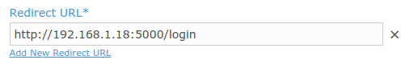
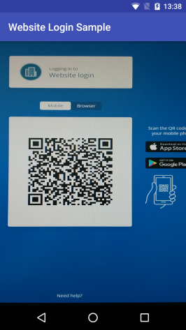
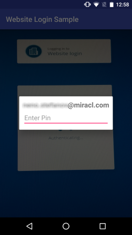
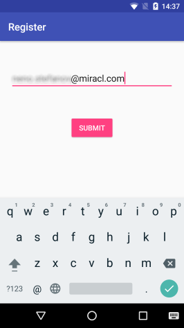
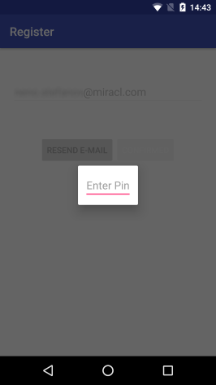
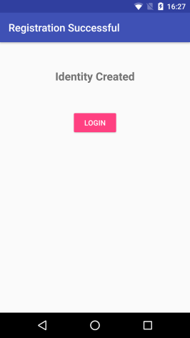

# Website Login Sample

* **category**: Samples
* **copyright**: 2019 MIRACL Technologies LTD
* **link**: https://github.com/miracl/sample-mobile-app-android/tree/master/WebsiteLoginSample

## Description

This sample demonstrates how to use the [MIRACL Android SDK](https://github.com/miracl/mfa-client-sdk-android) in order to login into a MIRACL Trust-enabled website using [MIRACL MFA Platform](https://trust.miracl.cloud) authentication via an Android device. This is the so called **MFA Platform Login** flow and here is the methods sequence you need to achieve it:


## Requirements

* Android Studio with Android SDK 16 or higher
* Android SDK build tools 25.0.0

## Setup
1. Checkout the sample project from: https://github.com/miracl/sample-mobile-app-android.git
>> git clone https://github.com/miracl/sample-mobile-app-android.git
2. [Run a demo web app](#create-a-demo-web-app-to-log-into)
3. [Configure the app with the issued credentials](#configure-the-app-with-the-issued-credentials)
4. Build the project from:
    * **Android Studio**
        1. Import the project - File -> Open -> \<sample-mobile-app-android\>
        2. Select the 'WebsiteLoginSample' from the configuration menu
        3. Click on the 'Build' menu, then choose 'Build Bundle(s) / APK(s)' and select 'Build APK(s)'
        4. The assembled apk will be located in `./WebsiteLoginSample/build/outputs/apk`
    * **Command Line:**
        1. Navigate to the top level folder of the Android project
        2. Execute `$ ./gradlew build`
        3. The assembled apk will be located in `./WebsiteLoginSample/build/outputs/apk`

## Create a demo web app to log into

In order to be able to test the demo Android app, you need to run a backend service as a relying party demo web app (RPA). The web app should authenticate to the [MIRACL Trust authentication portal](https://trust.miracl.cloud/), called also MFA, using [OpenIDConnect](https://openid.net/connect/) protocol. This means you need to login and create an application in it so you can take credentials (`client id` and `client secret`) for the communication. Sample ones could be found [here](https://github.com/miracl/maas-sdk-dotnet-core2#samples). Note that the redirect URL set in this MFA web application needs to match your demo web application, concatenated with `/login` by default.



## Configure the app with the issued credentials

Before building an Android app, you need to configure it through the [./WebsiteLoginSample/src/main/res/values/strings.xml](src/main/res/values/strings.xml) file:

```
<!-- The CID for the mfa platform -->
<string name="mpin_cid" formatted="false" translatable="false"></string>
```

As the owner of the MFA web app, your `Company ID` is visible as a tooltip in the top right corner of your company dashboard in the MFA portal:


## MFA Platform Login implementation by MFA Android SDK

The SDK is [intialized](https://github.com/miracl/mfa-client-sdk-android#status-initmapstring-string-config-context-context) in [SampleApplication.java](src/main/java/com/miracl/mpinsdk/websiteloginsample/SampleApplication.java) and the same instance is used throughout the flow using `getMfaSdk()` method.

```
sMPinMfa = new MPinMfaAsync(this);
sMPinMfa.init(this, getString(R.string.mpin_cid), null, null);
```
```
public static MPinMfaAsync getMfaSdk() {
    return sMPinMfa;
}
```

### QrReaderActivity.java

When the app is first loaded on your phone, the QR reader will be displayed.

Click on the Login button of your web browser app so a QR code appears and scan it with your phone:



Once the information from the QR code has been read within `onQrResult(String result)`, the access code and the base url are obtained from the qr-read url.

```
Uri qrUri = Uri.parse(result);
```

```
mCurrentAccessCode = qrUri.getFragment();

final String baseUrl = qrUri.getScheme() + "://" + qrUri.getAuthority();
```

Then [getMfaSdk().getServiceDetails](https://github.com/miracl/mfa-client-sdk-android#status-getservicedetailsstring-serviceurl-servicedetails-servicedetails) method passes the `baseUrl` to get the service details:

```
SampleApplication.getMfaSdk().getServiceDetails(baseUrl, new MPinMfaAsync.Callback<ServiceDetails>() {
  ...
}
```

After the service details are obtained the SDK sets its authentication API uri by [getMfaSdk().setBackend](https://github.com/miracl/mfa-client-sdk-android#status-setbackendstring-server) method using them:

```
SampleApplication.getMfaSdk().setBackend(mCurrentServiceDetails, new MPinMfaAsync.Callback<Void>() {
  ...
}
```

If the backend is set successfully, we can retrieve the session details using the access code:

```
SampleApplication.getMfaSdk().getSessionDetails(mCurrentAccessCode, new MPinMfaAsync.Callback<SessionDetails>() {
  ...
}
```

In `onBackendSet()` handler [getMfaSdk().listUsers](https://github.com/miracl/mfa-client-sdk-android#status-listuserslistuser-users) is called to get the SDK users. For simplicity of the sample, it is made to work with only one user so depending on every [user.getState()](https://github.com/miracl/mfa-client-sdk-android#user-makenewuserstring-id-string-devicename):

* If the user state is _not_ REGISTERED, the [getMfaSdk().deleteUser](https://github.com/miracl/mfa-client-sdk-android#void-deleteuseruser-user) method is executed to remove it

* If the user state is REGISTERED, it is filtered to correspond to the current backend:

```
user.getBackend().equalsIgnoreCase(currentBackend.getAuthority())
```

If there are no users a new intent launches the [RegisterUserActivity](#registeruseractivityjava) view.

If the user has previously registered with the backend service, then the `mEnterPinDialog` is shown to enable login to start <a id="authentication-process"></a> authentication process:



Once the user has entered their pin, the `onPinEntered(final String pin)` handler starts the authentication process with [getMfaSdk().startAuthentication](https://github.com/miracl/mfa-client-sdk-android#status-startauthenticationuser-user-string-accesscode). It sends the `user id` and the `access code` to the MFA server in order to start the authentication process:

```
SampleApplication.getMfaSdk().startAuthentication(mCurrentUser, mCurrentAccessCode, new MPinMfaAsync.Callback<Void>() {
  ...
}
```

If a status OK is return, [getMfaSdk().finishAuthentication](https://github.com/miracl/mfa-client-sdk-android#status-finishauthenticationuser-user-string-multifactor-string-accesscode) finalizes the authentication with the user's PIN:

```
SampleApplication.getMfaSdk().finishAuthentication(mCurrentUser, new String[]{pin}, mCurrentAccessCode, new MPinMfaAsync.Callback<Void>() {
  ...
}
```

If the call returns status OK, the authentication is successful and the user `getId()` and `getBackend()` [methods](https://github.com/miracl/mfa-client-sdk-android#user-makenewuserstring-id-string-devicename) are used to display a successful login message dialog to the user:


### RegisterUserActivity.java

Initial user registration process is managed in the [RegisterUserActivity.java](src/main/java/com/miracl/mpinsdk/websiteloginsample/RegisterUserActivity.java). The user is first asked to enter their email:



The user registration is started by `onSubmitClick()` handler where [getMfaSdk().makeNewUser](https://github.com/miracl/mfa-client-sdk-android#user-makenewuserstring-id) is executed to create a new user object:

```
SampleApplication.getMfaSdk().makeNewUser(email, "Android Sample App", new MPinMfaAsync.Callback<User>() {
  ...
}
```

Note that, for demonstration purposes, the `deviceName` variable is statically set here but it could be determined by users requirements.

When the user is created, the registration process can be invoked for them with [getMfaSdk().startRegistration](https://github.com/miracl/mfa-client-sdk-android#status-startregistrationuser-user-string-accesscode) method:

```
SampleApplication.getMfaSdk().startRegistration(SampleApplication.getCurrentAccessCode(), mCurrentUser, new MPinMfaAsync.Callback<Void>() {
  ...
}
```

If it passed, a confirmation message is sent to the user email in order to verify their identity registration. The user needs to open their mail and confirm the identity. Then they need to click `CONFIRMED` button:


This triggers `onConfirmClick()` handler which checks if the email confirmation is successful using [getMfaSdk().confirmRegistration](https://github.com/miracl/mfa-client-sdk-android#status-confirmregistrationuser-user) method:

```
SampleApplication.getMfaSdk().confirmRegistration(mCurrentUser, new MPinMfaAsync.Callback<Void>() {
  ...
}
```

The user also has an option to tap on the `RESEND E-MAIL` button in case they didn't receive an email. This will result in a call to the `onResendClick()` method. Getting a new email requires re-initialization of the registration process for the current user with [getMfaSdk().restartRegistration](https://github.com/miracl/mfa-client-sdk-android#status-restartregistrationuser-user) method:

```
SampleApplication.getMfaSdk().restartRegistration(mCurrentUser, new MPinMfaAsync.Callback<Void>() {
  ...
});
```

Finally, when the user verify their identity registration, the `mEnterPinDialog` is shown to the user to create their PIN:



Within the `onPinEntered(final String pin)` handler [getMfaSdk().finishRegistration](https://github.com/miracl/mfa-client-sdk-android#status-finishregistrationuser-user-string-multifactor) is used to pass the current user and their PIN to complete the registration process:

```
SampleApplication.getMfaSdk().finishRegistration(mCurrentUser, new String[]{pin}, new MPinMfaAsync.Callback<Void>() {
  ...
}
```

If status OK is returned, a new [RegistrationSuccessfulActivity](#registrationsuccessfulactivityjava) is started:

```
startActivity(new Intent(RegisterUserActivity.this, RegistrationSuccessfulActivity.class));
```

### RegistrationSuccessfulActivity.java

Once the user has registered this activity enables them to finally login to the service:



Within `onLoginClick()` handler the `mEnterPinDialog` is shown to the user to enter their PIN and start the [authentication process](#authentication-process) which we've already described.

## See also

* [DvsSample](https://github.com/miracl/sample-mobile-app-android/tree/master/DvsSample)
* [MobileAppLoginSample](https://github.com/miracl/sample-mobile-app-android/tree/master/MobileAppLoginSample)
* [BootstrapSample](https://github.com/miracl/sample-mobile-app-android/tree/master/BootstrapSample)
